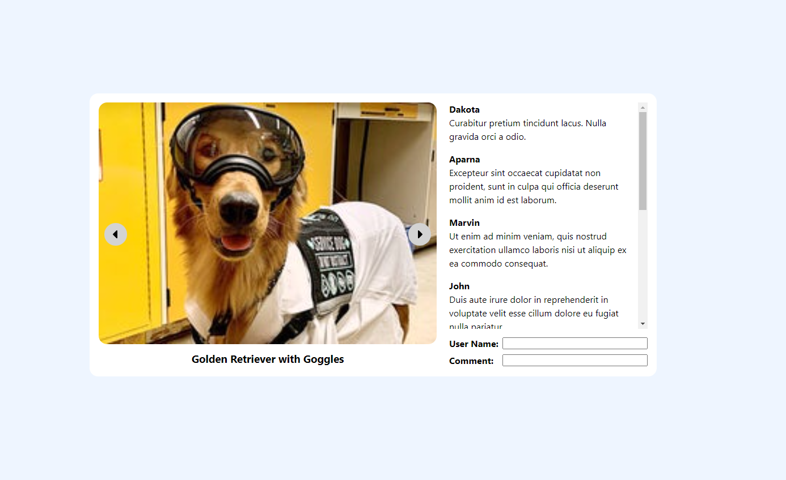

# Getting Started

Run `npm install` in the folder to install the project dependencies.\
Run `npm dev` to run the project

# Directions
- Recreate this webapp that you see in the picture using this React and NextJs project.
- Do not use any external frontend libraries (ie Bootstrap, Material, etc)
- Dimensions do not have to be exact. Use your best judgement.
- Create this only for desktop. Do not make this responsive nor optimize for mobile.
- Layout must be centered vertically and horizontally.
- Carousel must be functional.
- Carousel must loop. If you are on the last picture, clicking next should start over to the first image.
- Carousel does not need to autoplay.
- Do not worry about animations on the carousel or anywhere else in the project.
- Pressing the Enter key on the username or comment inputs should add a comment to the bottom of the list.  It should not add a comment if the User Name or Comment is blank.
- When finished, do not push to this repo. You will only need to share your project with us via screen share during your follow-up interview.

## Note
We understand take home tests can be time consuming and we wanted to present something we considered a fair project that wouldn't take up too much time (1-2 hours). We have purposely added some instructions on what not to do to prevent spending too much time on the assignment. When in doubt, go with the simplest and fastest option. Come prepared to discuss your decisions and what you would do given more time.